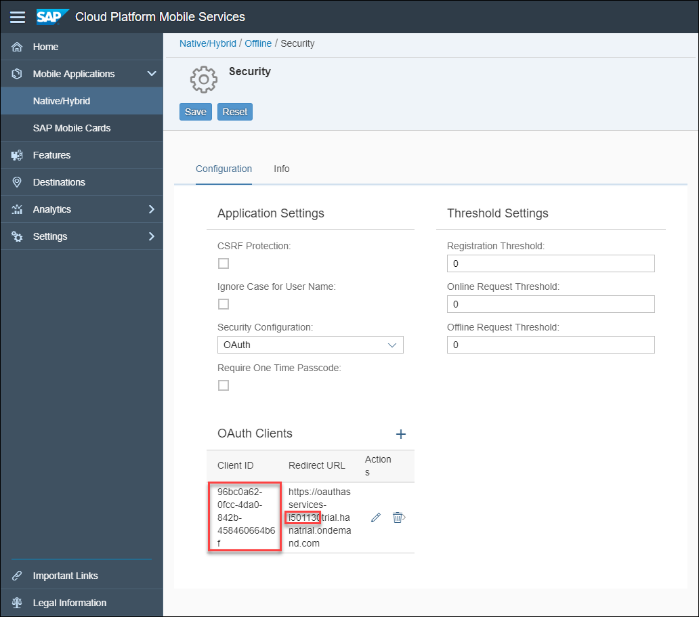

# SAP Cloud Platform SDK for Android Offline OData Sample

## Table of Contents
- [Purpose of the App](#purpose-of-the-app)
- [The Finished Product](#the-finished-product)
- [Setting Up Mobile Services](#setting-up-mobile-services)
- [Creating the Offline Store](#creating-the-offline-store)
- [Adding Defining Queries After Opening Store](#adding-defining-queries-after-opening-store)
- [Creating Entities](#creating-entities)
- [Syncing](#syncing)
- [Performing a Sync Using a Foreground Service](#performing-a-sync-using-a-foreground-service)
- [Highlighting Changed Entities](#highlighting-changed-entities)
- [Delta Tracking](#delta-tracking)
- [Repeatable Requests](#repeatable-requests)
- [Indexing Entities](#indexing-entities)
- [Error Handling](#error-handling)
- [Paging](#paging)

## Purpose of the App

The purpose of this app is to showcase the functionality of the Offline OData component of the SAP Cloud Platform SDK for Android.  The app downloads a portion of the backend's data, and the user then makes changes to the data locally. The user doesn't need a working internet connection to make changes once an initial download has been completed. Once an internet connection is re-established, the user can synchronize their local changes with the backend data with just the tap of a button.

This sample app will show how to indicate to the user which data has changed locally and has yet to be synchronized with the backend. Additionally, it will show how we can deal with differences between data in the user's local database and the OData Sample Service.

Other good sources of information on using the SDK are 
[Step by Step with the SAP Cloud Platform SDK for Android](https://blogs.sap.com/2018/10/15/step-by-step-with-the-sap-cloud-platform-sdk-for-android-part-1/)
and
[Get Started with SAP Cloud Platform SDK for Android](https://developers.sap.com/canada/group.sdk-android.html).

Finally if you have questions/comments/suggestions regarding this app please
post them using the tag [SAP Cloud Platform SDK for Android](https://www.sap.com/community/tag.html?id=73555000100800001281&tag=type:question).

## The Finished Product

The app enables customer info to be viewed and edited.


Let's start setting up this project!

## Setting Up Mobile Services
The initial mobile services configuration for the offline project is included in the project folder. In the mobile services cockpit, navigate to **Mobile Applications > Native/Hybrid** and click the **Import** button.


In the resulting prompt window, browse for the `com.sap.offline_1.0.zip` file in the Offline/mobile_services folder and select it. Click **Save**.


The imported project configuration will have an OAuth security endpoint that does not match your user name, so next, change the OAuth endpoint in the security section of the application to your own account. To do so, remove the current OAuth configuration in the **Security** section and create another one. Leave everything blank and click **OK**.


Click **Save**, and the rest of the details for the OAuth configuration such as **Authorization Endpoint**, **Token Endpoint**, **End User UI** will be filled in.


To successfully run the application, the OAuth string constants in the application need to be changed to reflect the new values. In the project, type `Ctrl + N` on Windows, or `Command + O` on Mac, and navigate to `MainActivity.java` and change the constants at the top of the file to match your username and client ID.


The `OAUTH_CLIENT_ID` string can be found in the mobile services cockpit, as shown below.



## Creating the Offline Store
There are a few things to take into account when creating an offline store. First of all, you must identify what data needs to be available offline. It is best to only download what is needed because large downloads will slow down the offline store's initial open time. Additionally, permitting the user to only download a subset of the data relevant to them can reduce the possibility of two users modifying the same data when offline.

Next, you need to set up the [Application Configuration File](https://help.sap.com/doc/c2d571df73104f72b9f1b73e06c5609a/Latest/en-US/docs/user-guide/odata/Offline_OData_Defining_Application_Configuration_File.html#application-configuration-file), which is used to specify many properties about how offline data will be handled in your application.  Below is an example of an application configuration file.

```text
[endpoint]
name=com.sap.edm.sampleservice.v2
prepopulate_offline_db=Y
prepopulate_offline_db_interval=1440
request_format=application/json;q=1,application/atom+xml;q=0.5
delta_request_format=application/atom+xml
batch_all_defining_queries=N
indexed_type=ESPM.Customer:LastName
case_sensitive_offline_db=Y
offline_db_collation=UTF8BIN
content_id_header_location=mime
allow_omitting_max_length_facet=N
json_datetimeoffset_in_utc=Y
max_delta_resends=5
check_repeatable_requests=Y
```

To view or change the application configuration file for the application go to the **Offline** feature on the Mobile Services cockpit for your application and click the button highlighted below:


Finally, you must create and open the store from within your code. The rest of this section will walk you through these steps. To choose which data the application downloads to the offline store, you need to create some [Defining Queries](https://help.sap.com/doc/c2d571df73104f72b9f1b73e06c5609a/Latest/en-US/docs/user-guide/odata/Offline_OData_Defining_Application_Configuration_File.html#defining-queries), and add them to the `OfflineODataProvider` as shown in the image below. The offline application already has some defining queries set up, in the `setupOfflineStore` method found in `MainActivity.java`. The offline store for the offline application will store **Products**, **Customers**, **Sales Order Headers**, and **Sales Order Items** in this example.

```Java
storageManager.setOfflineODataProvider(new OfflineODataProvider(url, offParam, ClientProvider.get(), null, null));
OfflineODataDefiningQuery productsQuery = new OfflineODataDefiningQuery("Products", "Products", false);
OfflineODataDefiningQuery customersQuery = new OfflineODataDefiningQuery("Customers", "Customers", false);
OfflineODataDefiningQuery salesOrderQuery = new OfflineODataDefiningQuery("SalesOrders", "SalesOrderHeaders", false);
OfflineODataDefiningQuery salesOrderItemsQuery = new OfflineODataDefiningQuery("SalesOrderItems", "SalesOrderItems", false);
storageManager.getOfflineODataProvider().addDefiningQuery(productsQuery);
storageManager.getOfflineODataProvider().addDefiningQuery(customersQuery);
storageManager.getOfflineODataProvider().addDefiningQuery(salesOrderQuery);
storageManager.getOfflineODataProvider().addDefiningQuery(salesOrderItemsQuery);
```

Creating\opening the offline store is as easy as implementing the `setupOfflineStore` method in your code and then calling it when you want to setup the offline store. Below is an example `setupOfflineStore` implementation. The full implementation can be found in the sample project in `MainActivity.java`.

```Java
private void setupOfflineStore() {
    AndroidSystem.setContext(getApplicationContext());

    try {
        URL url = new URL(serviceURL + "/" + connectionID);
        OfflineODataParameters offParam = new OfflineODataParameters();
        ...
        storageManager.setOfflineODataProvider(new OfflineODataProvider(url, offParam, ClientProvider.get(),
                                                                        null, null));
        ...
    } catch (Exception e) {
        e.printStackTrace();
        Log.d(myTag, "Exception encountered setting up offline store: " + e.getMessage());
    }

    storageManager.getOfflineODataProvider().open(() -> {
        Log.d(myTag, "Offline Store is open");
        storageManager.setESPMContainer(new ESPMContainer(storageManager.getOfflineODataProvider()));
        ...
        toastAMessageFromBackground("Offline Store opened");
    }, (error) -> Log.d(myTag, "Offline Store failed to open"));
}
```

## Adding Defining Queries After Opening Store
You can create **Defining Queries** either before the offline store is opened for the first time, or afterwards. It is better to create them all for the initial offline store open, because then all of the setup takes place at the same time. However, if you need to create **Defining Queries** elsewhere in code, simply use the `addDefiningQuery` method as before. After the defining queries are added you must perform a download with the `OfflineODataProvider` to retrieve the data referenced by the newly added defining queries.

The below code snippet shows how to add a new defining query to an already open store, followed by the required download operation. The defining queries can be seen in `MainActivity.java`.

```Java
try {
    // Create a new Defining Query
    OfflineODataDefiningQuery suppliersQuery = new OfflineODataDefiningQuery("Suppliers", "Suppliers", false);
    // Add the Defining Query to the Offline OData Provider
    storageManager.getOfflineODataProvider().addDefiningQuery(suppliersQuery);
    // Attempt to perform a download
    storageManager.getOfflineODataProvider().download(() -> {
        // Upon successful download, perform some action based on the results
        List<Supplier> suppliers = storageManager.getESPMContainer().getSuppliers();
        Log.d(myTag, "Found these suppliers: ");
        for(Supplier supplier : suppliers) {
            Log.d(myTag, supplier.getSupplierName());
        }
    }, (error) -> {
        Log.e(myTag, "Error occurred: " + error.getMessage());
    });
} catch (OfflineODataException e) {
    e.printStackTrace();
    Log.e(myTag, "Exception encountered: " + e.getMessage());
}
```

## Creating Entities
Creating entities using the offline API is similar to creating entities with the online API with a few key differences. The first difference is that when the `createEntity` method is called, the corresponding entity is only created locally on the offline store. This new entity is not present on the backend until a successful **upload** has been performed. When creating an entity locally, it is important to note that the primary key might be created by the server when the entity is uploaded, and these changes will be reflected on the local copy of the entity once it is re-downloaded.

To ensure that we always have access to the newly created entity, both before and after it is uploaded and re-downloaded from the backend, we must keep track of its `readLink`. This provides a way to access the entity even if its primary key is changed by the backend when it is uploaded. Below is a code sample showing this entire process. Please examine the comments of the code snippet for a detailed description of the process.

```Java
// First we create a customer with default properties
Customer newCustomer = new Customer();

// Next we set all the customer's properties using various data validation tactics to
// ensure that incorrect or invalid information has not been entered
newCustomer.setFirstName(firstNameField.getText().toString());
newCustomer.setLastName(lastNameField.getText().toString());
...
newCustomer.unsetDataValue(Customer.customerID);
storageManager.getOfflineODataProvider().createEntity(newCustomer, null, null);
Log.d(myTag, "Read Link: " + newCustomer.getReadLink());
Log.d(myTag, "Edit Link: " + newCustomer.getEditLink());

// Before uploading, the customer does not have an ID (it's generated by the server)
Log.d(myTag, "Customer ID is set: " + newCustomer.hasDataValue(Customer.customerID));
storageManager.getOfflineODataProvider().upload(() -> {
    storageManager.getOfflineODataProvider().download(() -> {
        // Using the readLink from before the upload we can refer to the same entity after the upload as well
        String originalReadLink = newCustomer.getReadLink();
        DataQuery query = new DataQuery().withURL(originalReadLink);
        Log.d(myTag, "Readlink before upload: " + originalReadLink);
        Customer afterDownload = storageManager.getESPMContainer().getCustomer(query);

        // The readLink of the entity changed after it has been redownloaded,
        // but the old local readLink is still valid
        Log.d(myTag, "Readlink after download: " + afterDownload.getReadLink());

        // Now that the customer has been uploaded, the ID has been set by the backend
        // So afterDownload.hasDataValue(Customer.customerID) will be true, and
        // Customer ID: will be a long string of letters and numbers
        Log.d(myTag, "After download, customer ID is set: " + afterDownload.hasDataValue(Customer.customerID));
        Log.d(myTag, "Customer ID: " + afterDownload.getCustomerID());
    }, (error) -> {
        Log.e(myTag, "Error during download after creation: " + error.getMessage());
    });
}, (error) -> {
    Log.e(myTag, "Error during upload: " + error.getMessage());
});
```
In the below screenshot, we can see how the server will change the `readLink` of the customer.


While the `readLink` and `editLink` are often the same, it is strongly advised to adhere to their recommended uses: `readLink` for loading, `editLink` for updating. For additional information about creating entities while offline, see the [Modifying Offline Data](https://help.sap.com/doc/c2d571df73104f72b9f1b73e06c5609a/Latest/en-US/docs/user-guide/odata/Offline_OData_Modifying_Offline_Data.html).

## Syncing

The purpose of the offline store is of course to maintain a database locally, and to keep it in sync with the data on the server.  In order to synchronize these two databases, the `onSync()` method in `MainActivity.java` uploads any on device made changes by calling upload, and subsequently performs a download to make sure the local data is the most recent data available. A sync is performed automatically each time the app opens, or if the sync icon is pressed.


The `onSync()` method is shown below.

```Java
private void onSync() {
  // Tells the user the upload has started
  toastAMessageFromBackground("Starting upload");
  // Attempts to upload the local offline store
  boundService.uploadStore(storageManager.getOfflineODataProvider(), () -> {
      Log.d(myTag, "Successfully uploaded local customer data to the backend.");  

      // If the upload succeeds then we attempt to download
      // This ensures that we obtain changes made by other users
      boundService.downloadStore(storageManager.getOfflineODataProvider(), () -> {
          toastAMessageFromBackground("Download completed, refreshing");
          Log.d(myTag, "Local customer data has been updated from the backend.");
          // We then check errors with the download/upload
          checkErrors();
          // Refresh the table to show us the newly downloaded data
          factory.postLiveData.getValue().invalidate();
      }, (error) -> {
          toastAMessageFromBackground("Download failed, check network connection");
          Log.d(myTag, "Error downloading customer data from the backend: " + error.getMessage());
          factory.postLiveData.getValue().invalidate();
      });
  }, (error) -> {
      toastAMessageFromBackground("Upload failed, check network connection");
      Log.d(myTag, "Error uploading the local customer data to the backend: " + error.getMessage());
  });
}
```

In the sample app, a `sync` is two operations in one: an upload, followed by a download. The upload pushes the local changes to the backend, and the download pulls other users' changes to your local store. Note that in custom implementations of the offline store, uploads and downloads don't have to be performed together. Perhaps an app only needs to download once a day and uploads many times. In this case, the app writer might want to separate the operations.  See [Synchronizing Data](https://help.sap.com/doc/c2d571df73104f72b9f1b73e06c5609a/Latest/en-US/docs/user-guide/odata/Offline_OData_Synchronizing_Data.html) for more information.

## Performing a Sync Using a Foreground Service

The app performs synchronization using a [Service](https://developer.android.com/guide/components/services).  The sample app attaches the offline store functionality to a service, which tells the O/S not to kill the offline store processes if the app enters the background. In the project, the `OfflineODataForegroundService.java` file contains the code for our service. Our custom service wraps the offline store methods `open`, `download` and `upload` using the following code.

```Java
public void openStore(OfflineODataProvider offlineODataProvider, @Nullable final Action0 successHandler,
    @Nullable final Action1<OfflineODataException> failureHandler) {
    Task task = new Task(Operation.OPEN, offlineODataProvider, successHandler, failureHandler);
    startTask(task);
}

public void downloadStore(OfflineODataProvider offlineODataProvider, @Nullable final Action0 successHandler,
    @Nullable final Action1<OfflineODataException> failureHandler) {
    Task task = new Task(Operation.DOWNLOAD, offlineODataProvider, successHandler, failureHandler);
    startTask(task);
}

public void uploadStore(OfflineODataProvider offlineODataProvider, @Nullable final Action0 successHandler,
    @Nullable final Action1<OfflineODataException> failureHandler) {
    Task task = new Task(Operation.UPLOAD, offlineODataProvider, successHandler, failureHandler);
    startTask(task);
}
```

The `OfflineODataForegroundService` class also contains another class, namely `Task`, which gets used in the above three methods. The `startTask` method performs the operation (open/download/upload), and creates a notification so the user can see the task's progress while the app is in the background. In the below screenshot, the app has been minimized but by taking a look at the notification drawer, it is clear that the offline store operations are still running.


There are a few key components in `MainActivity.java` that allow this service to operate. First of all, we need a few variables declared.
```Java
// Don't attempt to unbind from the service unless the client has received some
// information about the service's state.
private boolean shouldUnbind;
// To invoke the bound service, first make sure that this value is not null.
private OfflineODataForegroundService boundService;
```

Next, we must add an implementation of the `ServiceConnection` interface, as follows.

```Java
private ServiceConnection connection = new ServiceConnection() {
    public void onServiceConnected(ComponentName className, IBinder service) {
        // This is called when the connection with the service has been
        // established, giving us the service object we can use to
        // interact with the service.  Because we have bound to a explicit
        // service that we know is running in our own process, we can
        // cast its IBinder to a concrete class and directly access it.
        boundService = ((OfflineODataForegroundService.LocalBinder)service).getService();
    }

    public void onServiceDisconnected(ComponentName className) {
        // This is called when the connection with the service has been
        // unexpectedly disconnected -- that is, its process crashed.
        // Because it is running in our same process, we should never
        // see this happen.
        boundService = null;
    }
};

```

The following two methods need to be added to allow the service to attach to the activity.

```Java
void doBindService() {
    // Attempts to establish a connection with the service.
    if (bindService(new Intent(MainActivity.this, OfflineODataForegroundService.class),
            connection, Context.BIND_AUTO_CREATE)) {
        shouldUnbind = true;
    }
    else {
        Log.e(myTag, "Error: The requested service doesn't " +
                "exist, or this client isn't allowed access to it.");
    }
}

void doUnbindService() {
    if (shouldUnbind) {
        // Release information about the service's state.
        unbindService(connection);
        shouldUnbind = false;
    }
}
```

And then finally, we have to actually call `doBindService` and `doUnbindService` in the `onCreate` and `onDestroy` methods respectively.

```Java
@Override
protected void onCreate(Bundle savedInstanceState) {
    super.onCreate(savedInstanceState);
    doBindService();
    // ...
    // Setup offlineODataProvider from here on
}

@Override
protected void onDestroy() {
    super.onDestroy();
    doUnbindService();
    // ...
}
```
Since the service wraps the offline store's open, upload, and download methods, we use the wrapped methods when we want to perform such an operation, which can be seen in the `onSync` method shown above. 


## Highlighting Changed Entities
When you update your local data by performing a download from the backend, you can determine which entities have been added or updated using a filter on a `DataQuery`. The `DataQuery` is used to filter the data. The code snippet below shows an example of such a `DataQuery`.

```Java
DataQuery updatedCustomersQuery = new DataQuery()
    .filter(OfflineODataQueryFunction.upsertedLastDownload())
    .orderBy(Customer.lastName);
List<Customer> changedCustomers = storageManager.getESPMContainer().getCustomers(updatedCustomersQuery);
```

The `DataQuery` is filtered based on `upsertedLastDownload()`, and then orders the resulting set of `Customers` based on last name. The `upsertedLastDownload()` function retrieves customers that were inserted or updated in the local store during the last download.

You probably want to bring the user's attention to the data that is newly downloaded, perhaps by showing indicators on the key entries.


The sample application highlights 4 states which are described in the below table.

| Icon          | Name          | Meaning       |
| ------------- | ------------- | :------------ |
|   |  New Entry | An entry is considered to be **new** when it has either been updated and synchronized with the backend since the user started working on the app, or is a newly downloaded entry. If another user makes a change to the backend and then sync's it, upon downloading the database again, the entry will be highlighted with a yellow exclamation mark. |
|   | Local Entry | When entities are updated locally but not yet synchronized with the backend, it would be useful to highlight those changed entities, so the user knows they have to perform a sync. This state is known as the **local** state, and entities are considered to be in the **local** state when the `EntityValue.isLocal()` method returns `true`. Entites in the local state are indicated with an orange "refresh" image. |
|   | Error State | Entities are in the **error** state if something goes wrong. Similarly to local entities, the `EntityValue.getInErrorState()` method returns whether or not the entity is in the **error** state. Entities in the error state are indicated with a red exclamation mark.  |
|  | Default | Entities without a special state should be shown using some default image, such as an empty status dot. |

The following code snippet shows how we highlight these entities in our recycler view, which uses **Fiori Object Cells** to display the customer information. Make sure to consult the comments in the code snippet for a detailed description of what each line does. This `onBindViewHolder` method implementation can also be found in the Offline app's `CustomerRecyclerViewAdapter.java` file. In a custom project, you would need to provide your own image resources.

```Java
@Override
public void onBindViewHolder(ViewHolder holder, int position) {
    // Get the customer bound to the recycler view cell
    CustomerListItem customerListItem = getItem(position);
    Customer customer = customerListItem.customer;
    boolean isUpdated = customerListItem.isUpdated;

    // Get ready to update the corresponding object cell's image
    holder.myObjectCell.prepareDetailImageView().setVisibility(View.VISIBLE);
    holder.myObjectCell.setPreserveDetailImageSpacing(false);

    // Change the image shown in the object cell's detailed image section based on the customer's state
    if (customer.getInErrorState()) {
       // Display a red exclamation image if the customer is in the "Error" state
       holder.myObjectCell.setIcon(R.mipmap.ic_error_state, 0, R.string.red_dot);
    }
    else if (customer.isLocal()) {
         // Display an orange refresh symbol if the customer needs to be sync'd to the backend
         holder.myObjectCell.setIcon(R.mipmap.ic_local_state, 0, R.string.orange_dot);
    }
    else if (isUpdated) {
        // Display a yellow exclamation mark if the customer has been updated since the app was
        holder.myObjectCell.setIcon(R.mipmap.ic_yellow_bang_two, 0, R.string.yellow_dot);
    }
    else {
         holder.myObjectCell.setIcon(R.mipmap.ic_empty_dot, 0, R.string.white_dot);
    }
    holder.myObjectCell.setDetailImage(R.mipmap.ic_person_icon);
    holder.myObjectCell.setHeadline(customer.getLastName() + ", " + customer.getFirstName());
    holder.myObjectCell.setSubheadline(customer.getStreet() + ", " +
                                        customer.getCity() + ", " +
                                        customer.getCountry());
}
```

See [OfflineODataQueryFunction](https://help.sap.com/doc/c2d571df73104f72b9f1b73e06c5609a/Latest/en-US/docs/javadoc/offline-odata-api-doc/reference/com/sap/cloud/mobile/odata/offline/OfflineODataQueryFunction.html) for more information.

## Delta Tracking
In many cases the dataset that you are working with will be very large. A user's experience could suffer if they are forced to wait for a long download to finish every time they sync their changes.  With **Delta Tracking** enabled OData services, only entities that have been changed relative to the current state of the offline store will be downloaded, significantly reducing the amount of data transferred.  **Delta Tracking** is configured in your application configuration file from the Mobile Services Cockpit. The `track_deltas` property default value is auto which means it will make use of the OData service's delta tracking when available between the OData service and Mobile Services and will implement delta tracking between Mobile Services and the client.


See [Using Defining Queries to Build Entity Relationships](https://help.sap.com/doc/c2d571df73104f72b9f1b73e06c5609a/Latest/en-US/docs/user-guide/odata/Offline_OData_Defining_Application_Configuration_File.html#using-defining-queries-to-build-entity-relationships) for more information.

## Repeatable Requests
There are many ways that communication issues could interrupt a client request from receiving a response from the backend. In these cases, it is critical that the requests are only applied to the backend data once, since problems such as double billing could occur. This is where **Repeatable Requests** come in. They add specific headers to the requests made from the client, which are checked by Mobile Services. Mobile Services then ensures that the requests are only applied once. On the client side, repeatable requests are enabled by default, so **no action needs to be taken**. However, you can enable repeatable requests between Mobile Services and the OData backend. To do so, you need to add the following line to the application configuration file.

```ini
check_repeatable_requests=Y
```


For more information about repeatable requests you can visit the [Repeatable Requests](https://help.sap.com/doc/c2d571df73104f72b9f1b73e06c5609a/Latest/en-US/docs/user-guide/odata/Offline_OData_Repeatable_Requests.html) page of the documentation.

## Indexing Entities
Through the application configuration file, entities can be indexed based on their properties, for example a customer's last name or a product's description. On small datasets indexing might not make a noticeable change in the speed of query operations, however it can reduce lookup times significantly as the amount of data grows.

To add an index to your data, a line with this syntax must be added to your Mobile Services application configuration file.
```indexed_type=<Entity namespace>.<Entity name>:<Property name>```. 

The below is an example.

```ini
indexed_type=ESPM.Customer:LastName
```

The above example creates an index corresponding to the customers' `lastName` property. It is generally a good idea to create indexes on properties that will be used in query operations, such as searching for a product by its description or displaying a list of customers ordered by their last names.


## Error Handling
When syncing changes made while offline, conflicts can occur.  One example might be if two people attempted to update a description field of the same product.  Another might be updating a record that was deleted by another user.  The **Offline OData API** provides a way to access the `ErrorArchive`, which stores details of conflicts. There are a few types of errors the app handles, detailed in the table below.

| Code  | Meaning | How to produce the error |
| :---: | :--- | :---|
| `400` | A `400` error code indicates that the request could not be handled by the server. Possible causes include incorrectly formatted requests, or requests to make updates that aren't permitted. For example, you cannot submit a Sales Order with a quantity of 0. This is also known as a **backend data violation**.  | Tap the triple dots in the top right corner of the app and tap "Set a SalesOrderItem to 0 quantity". This will attempt to upload an invalid sales order quantity. |
| `404` | A `404` represents a "not found" error. This type of error is caused when the client is trying to request data that the server has either deleted or moved. | Using two different emulators/devices with the application running, delete a customer on one of the devices and tap the "sync" button. On the other device, make changes to the same customer and save them. Then sync the changes on the second device. The server will throw a `404` error because the customer you're trying to update has been deleted. |

For a full list of HTTP error codes, see [List of HTTP status codes](https://en.wikipedia.org/wiki/List_of_HTTP_status_codes).
The following code example shows how to check for errors when uploading the changes made locally. Consult the comments in the code for a detailed description of each piece.

```Java
private boolean checkErrors() {
    // These lines access the Error Archive
    EntitySet errorArchiveSet = storageManager.getSharedESPMContainer().getEntitySet("ErrorArchive");
    EntityType errorArchiveType = errorArchiveSet.getEntityType();
    com.sap.cloud.mobile.odata.Property requestEntityProp = errorArchiveType.getProperty("RequestEntity");
    com.sap.cloud.mobile.odata.Property affectedEntityProp = errorArchiveType.getProperty("AffectedEntity");
    com.sap.cloud.mobile.odata.Property requestBodyProp = errorArchiveType.getProperty("RequestBody");
    com.sap.cloud.mobile.odata.Property httpStatusCodeProp = errorArchiveType.getProperty("HTTPStatusCode");
    com.sap.cloud.mobile.odata.Property messageProp = errorArchiveType.getProperty("Message");
    com.sap.cloud.mobile.odata.Property methodProp = errorArchiveType.getProperty("RequestMethod");

    // We then query the error archive
    DataQuery errorArchQuery = new DataQuery().from(errorArchiveSet);

    // Get the list of errors in the ErrorArchive
    EntityValueList errors = storageManager.getSharedESPMContainer().executeQuery(errorArchQuery).getEntityList();

    // If there is at least one error: we get the first error in list for example, and handle it
    if (errors.length() > 0) {
        // In this if statement we handle the error
        EntityValue error1 = errors.get(0);
        String message = messageProp.getNullableString(error1);
        String body = requestBodyProp.getNullableString(error1);
        String method = methodProp.getNullableString(error1);
        int statusCode = 0;
        if (httpStatusCodeProp.getNullableInt(error1) != null) {
            statusCode = httpStatusCodeProp.getNullableInt(error1);
        }
        ...
    }
}
```

### Handling Specific Errors

A `400` represents a general error, but for the purpose of this application, it is returned when the user tries to submit a SalesOrderItem with quantity equal to 0. Therefore, upon receiving a `400` response code from the server, the app should decide if the user did in fact submit an invalid quantity, prompt the user to fill in the correct quantity, and then attempt a resubmit. Before examining the error handling code, note the constant defined in the `MainActivity.java` to represent such an error.

```Java
private final static String ZERO_QUANTITY_ERROR_MESSAGE = "The value of quantity should be greater than zero";
```
The error handling code is based on the following snippet.
```Java
if (statusCode == 400) {
    if (message.contains(ZERO_QUANTITY_ERROR_MESSAGE)) {
        // A status code of 400 is a general error
        storageManager.getESPMContainer().loadProperty(affectedEntityProp, error1, null);
        SalesOrderItem errorSalesOrderItem = (SalesOrderItem) affectedEntityProp.getEntity(error1);
        runOnUiThread(() -> changeQuantity(errorSalesOrderItem));
        return false;
    }
}
```
The code that sends a SalesOrderItem with quantity 0 can be found in `MainActivity.java` and is also shown below.
```Java
private void zeroSalesOrderItems() {
    // Setup the data query to get the sales order items
    DataQuery productQuery = new DataQuery().from(ESPMContainerMetadata.EntitySets.salesOrderItems).top(1);
    SalesOrderItem salesOrderItem = storageManager.getESPMContainer().getSalesOrderItem(productQuery);

    // Update the quantity of the sales order to 0 -- this will create a BACKEND DATA VIOLATION
    salesOrderItem.setQuantity(new BigDecimal(0));

    // Attempts to updates the entity
    storageManager.getESPMContainer().updateEntity(salesOrderItem);
    storageManager.getOfflineODataProvider().upload(() -> checkErrors(), (error) ->
        Log.e(myTag, "Error occurred while uploading SalesOrderItem with zero quantity: " + error.getMessage()));
}
```
Since this create request will produce a **backend data violation**, we'll need to prompt the user to enter the correct value.
We do so by using the `changeQuantity` method. The `changeQuantity` method simply produces a prompt for the user to fill in the correct data.

```Java
private void changeQuantity(SalesOrderItem salesOrderItem) {
    // This dialog could also be provided by the Fiori Onboarding Library
    // We create the dialog using an AlertDialog.Builder
    AlertDialog.Builder builder =
                  new AlertDialog.Builder(this, android.R.style.Theme_DeviceDefault_Dialog_NoActionBar_MinWidth);
    builder.setMessage("The quantity must be greater than 0. Update the quantity below.");
    builder.setTitle("Change Quantity");

    // Set up the input
    View viewInflated = LayoutInflater.from(this).inflate(R.layout.quantity_edit_text_layout,
                                                          findViewById(android.R.id.content),
                                                          false);
    final EditText input = (EditText) viewInflated.findViewById(R.id.input);
    input.setText(String.format("%.0f", salesOrderItem.getQuantity()));
    builder.setView(viewInflated);

    // Set up the buttons
    builder.setPositiveButton("OK", new DialogInterface.OnClickListener() {
        @Override
        public void onClick(DialogInterface dialog, int which) {
            String inputQuantity = input.getText().toString();
            BigDecimal newQuantity = new BigDecimal(inputQuantity);
            salesOrderItem.setQuantity(newQuantity);

            // Attempts to update the entity and possibly call checkErrors()
            storageManager.getESPMContainer().updateEntity(salesOrderItem);
            storageManager.getOfflineODataProvider().upload(() -> {
                checkErrors();
            }, (error) -> {
                Log.e(myTag, "Error in attempting to re-upload the SalesOrderItem: " + error.getMessage());
            });
        }
    });
    builder.setNegativeButton("Cancel", new DialogInterface.OnClickListener() {
        @Override
        public void onClick(DialogInterface dialog, int which) {
            dialog.cancel();
        }
    });

    // Finally, show the dialog
    builder.show();
}
```

An error with code `404` represents a **not found** error, and in the app is caused when changes are made to a customer who has been deleted by another user. When receiving a `404` error, upon determining that this scenario has occurred, the app provides the user with the option of letting the customer be deleted, or instead, creating a new customer with the old customer's information, and the changes the user is trying to make. The app achieves this using the following code.

```Java
if (statusCode == 404) {
    // A status code of 404 means we need to remove the customer from the local list
    for (CustomerListItem cli : storageManager.getCustomersListToDisplay().getValue()) {
        if (cli.customer.equals(customer)) {
            factory.postLiveData.getValue().invalidate();
            break;
        }
    }
    // getInfo() gives the user the option to create a new customer according to the latest changes,
    // since the customer intended to be updated has been deleted in the back-end.
    Log.d(myTag, customer.toString());
    getInfo(customer.toString());
    storageManager.getESPMContainer().deleteEntity(errors.get(0));
    return true;
}
```
As described in the comments, the `getInfo()` function captures the customer causing the problems, and allows the user to create a new customer with identical details.
```Java
private void getInfo(String customerInformation) {
    // We use a JSON Object parser to read the body
    JSONObject customerInfo = new JSONObject(customerInformation);
    String city = customerInfo.getString("City");
    String country = customerInfo.getString("Country");
    ...
    // Pass information to customer create activity
    Intent i = new Intent(this, ChangeCustomerWarningActivity.class);
    i.putExtra("city", city);
    ...
    this.startActivity(i);
}
```
The full implementation can be found in `MainActivity.java`.

For more information on error handling visit [Handling Errors and Conflicts](https://help.sap.com/doc/c2d571df73104f72b9f1b73e06c5609a/Latest/en-US/docs/user-guide/odata/Offline_OData_Handling_Errors_And_Conflicts.html) and [Handling Failed Requests](https://help.sap.com/doc/c2d571df73104f72b9f1b73e06c5609a/Latest/en-US/docs/user-guide/odata/Offline_OData_Handling_Failed_Requests.html)

## Paging

When dealing with a large dataset, the user's experience can be negatively impacted if the data takes too long to load. Paging confronts this problem by partitioning the data into pages. This way, the data is loaded page by page and not all at once, taking less time for the application to become responsive. Paging can be done either on the client side or the server side.

Client side paging involves including `top` and `skip` clauses in your data queries to limit the data that is returned. The `top` clause is used to limit the number of returned results, and the `skip` clause allows you to get entries from anywhere in the set. As an example, with 50 items per page, to read the first page we would make a query with `top = 50` and `skip = 0`. Then for the second page we would use `top = 50` and `skip = 50`, and so on. The code snippet below illustrates how this can be used. Simply include these clauses anywhere you perform a data query to page your downloads.

```Java
DataQuery query = new DataQuery().skip(100).top(50);
List<Event> events = eventService.getEvents(query);
```

Server side paging, which is implemented in this app, involves the server determining how much data to send back for a request. A page size can be specified in the request, however it is up to the server whether or not it supports custom page sizes. To fetch subsequent pages, the server includes a `nextLink` URL in the response. By querying this `nextLink`, the next page of data can be accessed, which includes its own `nextLink`. A code example, using Android's `Paging library`, is given below.

```Java
@Override
public void loadInitial(@NonNull LoadInitialParams<DataQuery> params,
                          @NonNull LoadInitialCallback<DataQuery, CustomerListItem> callback) {
    // Perform the data query
    DataQuery pageQuery = new DataQuery().from(ESPMContainerMetadata.EntitySets.customers)
                                          .orderBy(Customer.lastName); //.page(10) not needed here as set in setupOfflineStore
    QueryResult result = espmContainer.executeQuery(pageQuery);
    List<Customer> customersList = Customer.list(result.getEntityList());
    DataQuery changedCustomersQuery = new DataQuery().orderBy(Customer.lastName)
                                                       .filter(OfflineODataQueryFunction.upsertedLastDownload());
    List<Customer> changedCustomers = espmContainer.getCustomers(changedCustomersQuery);
    List<CustomerListItem> customerListItems = new ArrayList<>();
    for (Customer customer : customersList) {
        CustomerListItem customerListItem;
        if (changedCustomers.contains(customer)) {
            customerListItem = new CustomerListItem(customer, true);
        }
        else {
            customerListItem = new CustomerListItem(customer, false);
        }
        customerListItems.add(customerListItem);
    }

    // Gets the link to the next page
    callback.onResult(customerListItems, null, result.getNextQuery());
}
```

This method is called to load the **first** page of data into the app, providing a link to the next page of data in the `callback.onResult` call at the end. The `nextLink` approach lends itself well to the [PageKeyedDataSource](https://developer.android.com/reference/android/arch/paging/PageKeyedDataSource) way of loading data into a `PagedList`.

For more information regarding client and server side paging visit [Using the OData API](https://help.sap.com/doc/c2d571df73104f72b9f1b73e06c5609a/Latest/en-US/docs/user-guide/odata/Using_OData_API.html). For more information regarding the Android Paging library, check the official Google documentation at [Paging Library Overview](https://developer.android.com/topic/libraries/architecture/paging/).
